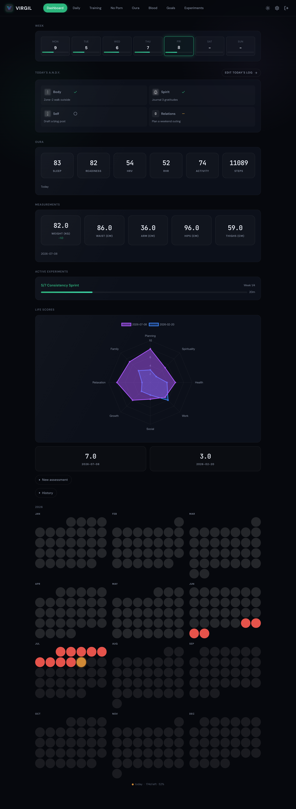
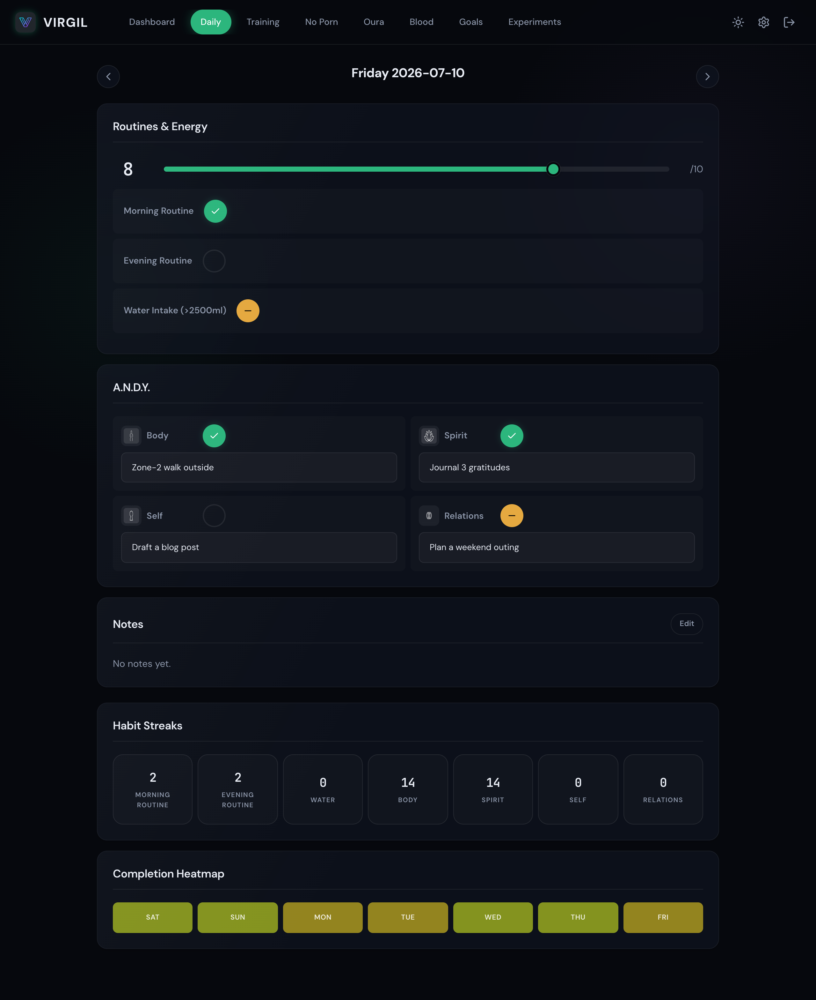
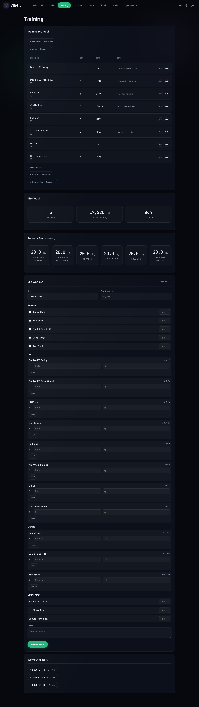
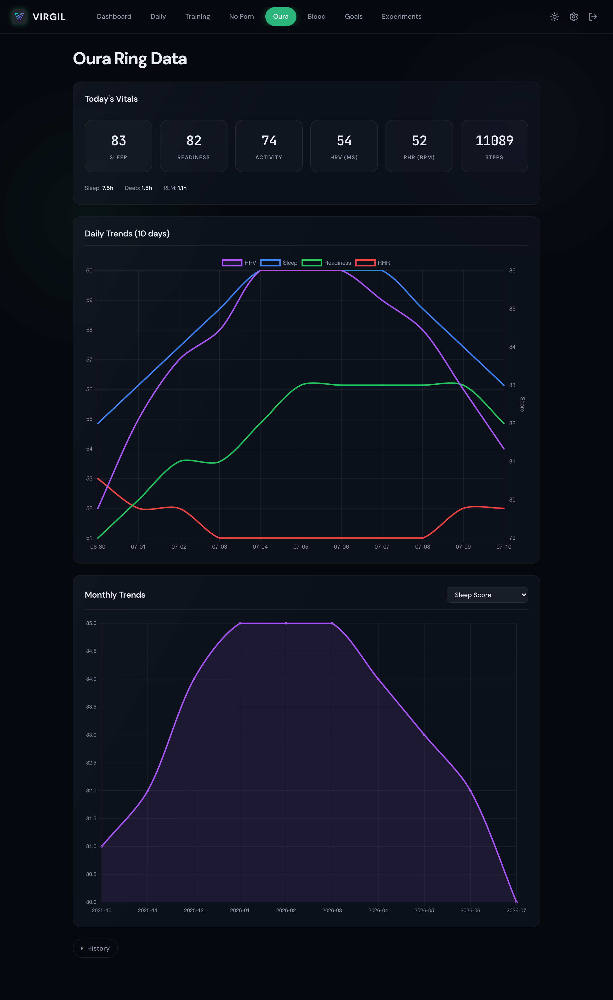
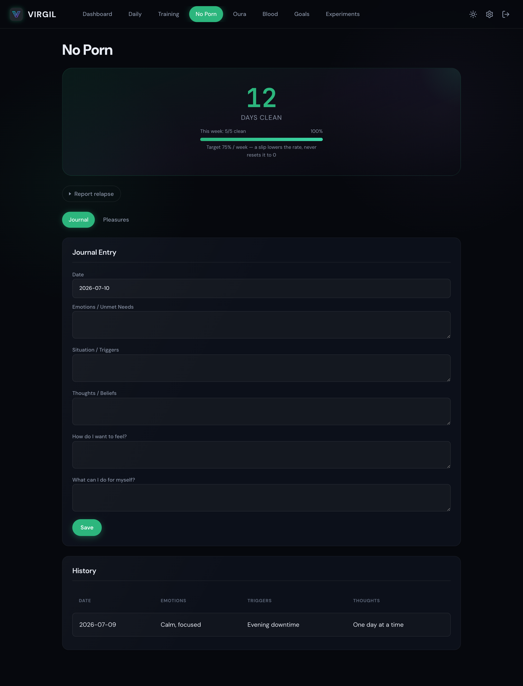
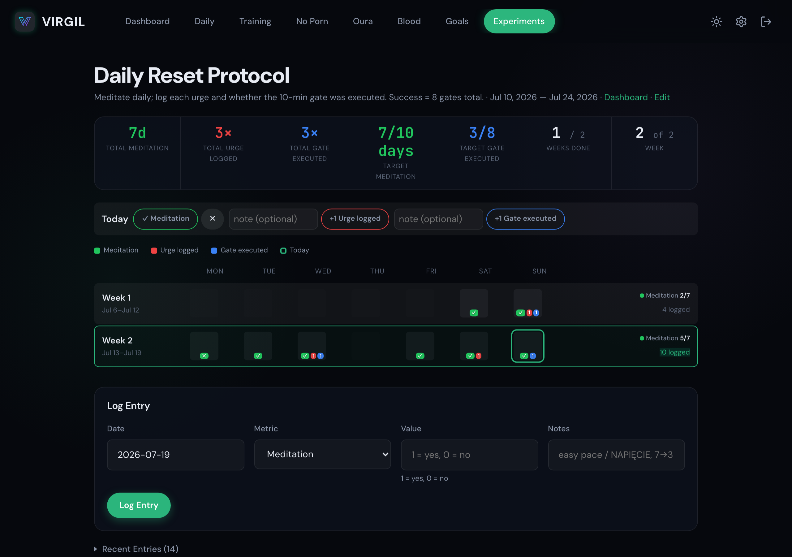

# Virgil

Personal life-tracking dashboard built with FastAPI, SQLite, Jinja2, and HTMX.

Virgil tracks daily habits, training sessions, health metrics, goals, experiments, and personal development programs — all through a mobile-friendly UI with dark/light theme support. Data lives in SQLite (source of truth) with on-demand markdown export for LLM-based reviews.

> **[CHANGELOG](CHANGELOG.md)** | **[SPEC](SPEC.md)** | **[CONTRIBUTING](CONTRIBUTING.md)** | **[SECURITY](SECURITY.md)**

## Screenshots

<sub>All screenshots use the built-in demo seeder (`scripts/seed_demo.py`) — fictional data, no real user information.</sub>

<table>
<tr>
<td width="50%"><br><sub><b>Dashboard</b> — daily rollup, Oura vitals, measurements, life-scores radar</sub></td>
<td width="50%"><br><sub><b>Daily</b> — energy, routines & A.N.D.Y. tasks (AI-suggested)</sub></td>
</tr>
<tr>
<td width="50%"><br><sub><b>Training</b> — protocol, per-set logging, weekly volume & PBs</sub></td>
<td width="50%"><br><sub><b>Oura</b> — daily & monthly trends (sleep, HRV, readiness, RHR)</sub></td>
</tr>
<tr>
<td width="50%"><br><sub><b>No Porn</b> — weekly clean-rate, journal & pleasures</sub></td>
<td width="50%"><br><sub><b>Experiments</b> — weekly-target habit sprints</sub></td>
</tr>
</table>

## Tech Stack

- **Backend**: Python 3.12, FastAPI, aiosqlite
- **Frontend**: Jinja2 templates, HTMX, Alpine.js, Chart.js, Lucide icons
- **Styling**: Custom CSS with dark/light theme via CSS custom properties
- **Database**: SQLite with WAL mode, versioned migration system
- **Auth**: Multi-user with per-user isolated SQLite databases, email + password + TOTP MFA
- **LLM Integration**: LiteLLM (supports Anthropic, OpenAI, Gemini, Mistral, Groq, Ollama, and more)
- **Charts**: Chart.js (line, bar, sparkline, radar, dual-axis) — theme-aware
- **PWA**: Service worker with offline support, installable on mobile

## Quick Start

### Local Development (uv)

```bash
# Install dependencies
uv sync

# Run the app (hot reload enabled, port 8123)
VIRGIL_SECOND_BRAIN_PATH="/path/to/second-brain/0 - LLM/ZYCIE/" \
  uv run python -m app
```

On first launch, navigate to `http://localhost:8123` — sign up at `/signup` (email + password) and complete the onboarding wizard. Registration is closed by default, but the **first** account can always be created (bootstrap owner); open it for more users with `VIRGIL_REGISTRATION_OPEN=true`.

`VIRGIL_ENV` defaults to `local` which enables hot reload. Set to `prod` to disable.

### Docker (Local)

```bash
docker compose up -d --build
```

### QNAP NAS Deployment

Virgil runs on QNAP via Docker with Cloudflare Tunnel for zero-port exposure:

```
Browser (virgil.example.com)
    |
    v
Cloudflare Edge
    |
    v  (outbound-only tunnel)
+------------------------------------------+
| QNAP NAS                                |
|  +-------------+    +-----------------+  |
|  | cloudflared  |<-->| virgil          |  |
|  | (tunnel)     |    | FastAPI + SQLite|  |
|  +-------------+    +-----------------+  |
|                          |               |
|              +-----------+----------+    |
|              |                      |    |
|         /data (DB)        /second-brain  |
|         (read-write)       (read-write)  |
+------------------------------------------+
```

**Step 1: Create Cloudflare Tunnel**

1. Go to [Cloudflare Zero Trust](https://one.dash.cloudflare.com/) > Networks > Tunnels
2. Create a tunnel, copy the token
3. Add public hostname: subdomain `virgil`, domain `example.com`, service `http://virgil:8123`

**Step 2: Configure secrets**

```bash
cp .env.example .env
# Edit .env — fill in CLOUDFLARE_TUNNEL_TOKEN (required) and API keys (optional)
```

**Step 3: Sync and deploy**

Clone or sync the project to your NAS, then deploy via SSH:

```bash
ssh <user>@<NAS_IP>
cd /path/to/virgil
mkdir -p data
# GIT_SHA versions the PWA cache — without it every build reports "unknown"
# and clients can keep stale CSS/JS after a deploy.
docker build --build-arg GIT_SHA=$(git rev-parse --short HEAD) -t virgil:latest .
docker compose up -d
```

> **QNAP Container Station limitation**: Container Station UI doesn't support `build:` or `${VAR}` interpolation in docker-compose. Build the image via SSH first, then manage in Container Station. The compose file uses `image: virgil:latest` for compatibility.

**Rebuilding after code changes:**

```bash
ssh <user>@<NAS_IP>
cd /path/to/virgil
docker build --build-arg GIT_SHA=$(git rev-parse --short HEAD) -t virgil:latest . && docker compose up -d
```

## Configuration

All configuration via environment variables:

| Variable | Default | Description |
|---|---|---|
| `VIRGIL_ENV` | `local` | `local` (hot reload) or `prod` (no reload) |
| `VIRGIL_CENTRAL_DB_PATH` | `./data/virgil-central.db` | Central user registry database |
| `VIRGIL_SECOND_BRAIN_PATH` | (empty) | Path to markdown files directory |
| `VIRGIL_HOST` | `0.0.0.0` | Server bind host |
| `VIRGIL_BASE_URL` | `http://localhost:8123` | Public URL (for OAuth callbacks, webhook URLs) |
| `VIRGIL_ENCRYPTION_KEY` | (auto-generated) | Fernet key for encrypting secrets |
| `VIRGIL_ADMIN_EMAILS` | (empty) | Comma-separated admin emails (always have admin role) |
| `VIRGIL_REGISTRATION_OPEN` | `false` | Allow new user signups. The first account (bootstrap owner) can always be created |
| `VIRGIL_INTERNAL_LLM_MODEL` | `gemini/gemini-3-flash-preview` | Internal LLM for onboarding/system features |
| `VIRGIL_INTERNAL_LLM_KEY` | (empty) | API key for internal LLM |
| `VIRGIL_API_KEY` | (empty) | Read-only REST API key (empty = API disabled) |
| `VIRGIL_API_USER_EMAIL` | (empty) | Which user's data the API serves (default: first active admin) |
| `VIRGIL_API_SENSITIVE` | `false` | Expose `/api/noporn` (intimate journal content) over the API key |
| `CLOUDFLARE_TUNNEL_TOKEN` | (none) | Cloudflare Tunnel token (docker-compose only) |

Port is always **8123**.

## Features

### Dashboard (`/`)
Overview with weekly completion stats, life score radar chart, Oura vitals, 7-day sparklines (HRV, sleep score, energy), year calendar dot-matrix, active experiments summary, and optional AI morning briefing.

### Daily Log (`/daily`)
- Energy level (1-10 slider)
- Morning/evening routine toggles (three-state: done/skipped/pending)
- A.N.D.Y. task system — 4 life areas (Body, Spirit, Self, Relations) with toggle + description
- A.N.D.Y. AI generation — uses configured LLM to suggest daily tasks based on goals, training, and weekly context
- Saturday body measurements (weight, arm, waist, hips, thighs)
- Markdown notes with edit/preview toggle
- Per-habit streak counters and 7-day completion heatmap
- Swipe left/right to navigate between days (mobile)
- Arrow keys to navigate between days (desktop)

### Training (`/training`)
- Exercise protocol with 4 sections: Warmup, Core, Cardio, Stretching
- Exercise CRUD — add, edit, delete exercises inline per section
- Section-specific workout logging:
  - **Warmup**: done toggle + duration (min)
  - **Core**: multi-set reps + weight (kg)
  - **Cardio**: multi-set rounds + duration (min)
  - **Stretching**: duration (min)
- This Week KPIs — sessions count, total volume (Core, kg), total reps
- Personal Bests — max weight per Core exercise (12-week window)
- Session history with expandable details (including duration column)
- Rest timer with presets (fixed-position bar above mobile nav)

### No Porn (`/feniks`)
Recovery tracker (hidden by default — enable in Settings > General > Modules):
- **Streak hero** — days clean counter with progress bar
- **Weekly clean rate** — a slip doesn't erase the week
- **Journal** — daily emotional processing (emotions, triggers, thoughts, desired feelings, coping strategies)
- **Pleasures** — daily two-pleasures log
- **Relapse reporting** — reset events with notes

### Oura (`/oura`)
Daily and monthly Oura Ring metrics — sleep, readiness, activity, HRV, stress, and more.

- **API Integration**: OAuth2 connection to Oura Cloud for automatic data sync
- **Webhook Support**: Real-time data push from Oura with HMAC-SHA256 signature verification
- **Today's Vitals**: Real-time card with sleep score, readiness, HRV, RHR, steps, stress/recovery minutes. Activity and steps fall back to yesterday's values (with label) when today's data isn't yet available from the API
- **Daily Trends**: 10-day dual-axis chart (HRV/RHR + sleep/readiness scores)
- **Daily History**: Browsable 30-day table
- **Monthly Trends**: Aggregated averages with Chart.js trend charts
- **Manual Entry**: Fallback form for entering monthly averages
- **Rate Limit Handling**: 429 responses trigger exponential backoff with Retry-After

### Bloodwork (`/bloodwork`)
Blood test results organized by marker category with reference ranges, flag indicators, and per-marker trend charts.

### Life Scores (`/life-scores`)
Periodic self-assessment across 8 life areas with power level composite score and radar chart visualization.

### Goals (`/goals`)
Goal mapping across 8 life areas with 1yr/3yr/10yr horizons. Inline editing support.

### Experiments (`/experiments`)
Time-boxed activity experiments with:
- Weekly targets (min/max minutes)
- Activity types with color coding
- Day-by-day grid with progress tracking
- AI-generated weekly summaries
- Oura workout auto-import

### Settings (`/settings`)
Five-tab settings page:
- **General** — Database info, LLM provider management (add/activate/delete Claude, OpenAI, Gemini keys), feature flag modules (enable/disable optional modules like Feniks)
- **Integrations** — OAuth2 connections (Oura Ring), webhook management, sync controls
- **Data** — Markdown export (weekly/monthly/yearly/all), data import, JSON/CSV download, database backup
- **Automation** — Backup scheduling, Oura auto-sync interval, morning briefing toggle, markdown auto-export (for OpenClaw integration)
- **Security** — MFA setup/disable (TOTP with QR code), sync log viewer

## UI/UX

### Dark/Light Theme
Toggle via the sun/moon button in the navigation bar. Theme preference is saved to localStorage (instant, no FOUC) and also stored server-side per user. All charts re-render with theme-appropriate colors.

### Keyboard Shortcuts
Press `?` to see the shortcut overlay. Navigation uses a `g` prefix:

| Shortcut | Action |
|---|---|
| `g d` | Dashboard |
| `g l` | Daily |
| `g t` | Training |
| `g f` | Feniks (when enabled) |
| `g o` | Oura |
| `g b` | Bloodwork |
| `g e` | Experiments |
| `g g` | Goals |
| `g s` | Settings |
| `<-` / `->` | Previous/next day (daily page) |
| `?` | Toggle shortcut overlay |
| `Esc` | Close overlay |

### Swipe Gestures
On mobile, swipe left/right on the daily page to navigate between days. Uses `data-swipe-left` / `data-swipe-right` attributes (80px minimum, 300ms maximum, horizontal > vertical).

### PWA / Offline
Virgil is installable as a PWA. The service worker provides:
- **Cache-first** for `/static/` assets
- **Stale-while-revalidate** for CDN resources (HTMX, Alpine.js, Chart.js, Lucide, Flatpickr)
- **Network-only** for pages — authenticated HTML is never cached (privacy), offline shows the fallback page
- **Network-only** for POST requests (passthrough) — logging data requires a connection

## Security

### Authentication
- Email + password with bcrypt hashing
- Optional TOTP MFA via `pyotp` + `qrcode`
- Signed cookie sessions via `itsdangerous.TimestampSigner` (7-day expiry)
- MFA-pending sessions blocked from protected routes

### Middleware Stack
Request processing order:
1. **Security Headers** — CSP (including `worker-src 'self'`, `'unsafe-eval'` for Alpine.js), X-Frame-Options, X-Content-Type-Options, Referrer-Policy, Permissions-Policy
2. **Rate Limiting** — 120 req/min general, 10 req/min for auth endpoints (per-IP sliding window)
3. **Authentication** — Cookie-based session verification (public paths: login, signup, MFA, offline, healthz, service worker, per-user Oura webhooks)
4. **Feature Flags** — Loads `feature_*` settings from `app_settings` into `request.state.features` for templates and route guards
5. **CSRF Protection** — Double-submit cookie on all POST forms (exempt: Oura webhook endpoint)

### Data Protection
- OAuth tokens and client secrets: Fernet-encrypted in database
- LLM API keys: Fernet-encrypted at rest
- Webhook secrets: stored in database, used for HMAC-SHA256 signature verification
- Encryption key: `VIRGIL_ENCRYPTION_KEY` env var, or auto-generated at `data/virgil.key` (0600 permissions)
- Server-side input validation on all form endpoints

## Database Migrations

Virgil uses a numbered migration system instead of `CREATE TABLE IF NOT EXISTS`:

- Migrations live in `app/migrations/NNN_name.py`, each exposing an `async def up(db)` function
- The `schema_migrations` table tracks applied versions
- On startup, `run_migrations()` discovers and applies pending migrations in order
- Each migration is committed individually and idempotent (safe to run on existing databases)

Current migrations:
| Version | Name | Description |
|---|---|---|
| 001 | `initial_schema` | Full schema + seed data (feniks config, goal areas, milestones, exercises, app settings) |
| 002 | `migrate_llm_api_keys` | Renames `api_key` to `api_key_enc`, encrypts plaintext values |
| 003 | `experiment_sources` | Adds `source`/`source_ref` columns and `source_match` for Oura workout import |
| 004 | `add_webhook_columns` | Adds `webhook_secret` column to `integrations` table |
| 005 | `feature_flags` | Seeds `feature_feniks=0` in `app_settings` (Feniks hidden by default) |
| 006 | `training_overhaul` | Adds `duration` column to entries, translates exercises to English, adds Stretching section |
| 007 | `litellm_model_strings` | Converts `llm_providers` rows to LiteLLM format (`anthropic/...`, `gemini/...`) |
| 008 | `onboarding` | Creates `user_profiles` table + `onboarding_completed` setting |
| 009 | `exercise_library` | Creates the user-editable exercise picker dictionary |
| 010 | `rename_feniks_flag` | Renames `feature_feniks` to `feature_no_porn` |
| 011 | `exercise_metric` | Per-exercise `metric` ('reps' vs 'time') so timed holds don't pollute volume KPIs |
| 012 | `llm_provider_no_check` | Rebuilds `llm_providers` without the provider CHECK (unblocks anthropic/mistral/groq/ollama) |
| 013 | `training_exercise_archive` | Adds `training_exercises.archived` — deleting an exercise keeps history |

## Data Model

### Central Database (`virgil-central.db`)
- `users` — identities, bcrypt password hashes, roles, TOTP secrets, per-user DB filenames
- `webhook_routes` — opaque webhook ids → user mapping for public Oura callbacks

### Per-User Tables
- `schema_migrations` — applied migration versions
- `app_settings` — key-value configuration store (includes `feature_*` flags for optional modules)
- `daily_logs` — daily tracking entries
- `body_measurements` — Saturday weigh-ins
- `daily_briefings` — AI-generated morning briefings
- `training_exercises` — exercise protocol (seeded)
- `training_sessions` + `training_entries` — workout logs
- `feniks_config`, `feniks_journal`, `feniks_pleasures`, `feniks_milestones` — Feniks program
- `pmo_events` — relapse/reset events
- `oura_daily` — Oura Ring per-day data (from API or webhook)
- `oura_monthly` — Oura Ring monthly averages (computed from daily or manual)
- `oura_workouts` — Oura workout data
- `blood_markers` + `blood_results` — lab results
- `life_scores` — periodic assessments
- `goal_areas` + `goals` — life goals
- `experiments`, `experiment_weeks`, `experiment_entries`, `experiment_activity_types` — experiments
- `experiment_summaries` — AI-generated weekly experiment summaries
- `integrations` — OAuth2 credentials + webhook secrets (Fernet-encrypted)
- `llm_providers` — LLM API key storage (Fernet-encrypted)
- `sync_log` — export/sync audit trail

### Three-State Toggles
Habit and task items use a three-state cycle: `done` > `skipped` > `pending`, mapped to `[x]` / `[-]` / `[ ]` in markdown.

## Oura Ring Integration

Virgil connects to the Oura API v2 via OAuth2 for automatic daily health data sync, with optional webhook for real-time updates.

### Setup
1. Register an app at [cloud.ouraring.com/oauth/applications](https://cloud.ouraring.com/oauth/applications)
2. Set the redirect URI to `{VIRGIL_BASE_URL}/settings/oura/callback`
3. In Virgil Settings > Integrations, enter your `client_id` and `client_secret`
4. Click "Connect to Oura" and authorize access
5. Click "Sync Now" to pull the last 30 days of data

### Webhook (Real-time Sync)
1. In Settings > Integrations, click "Enable Webhook" on the Oura card
2. Virgil registers one subscription per handled `(event_type, data_type)` pair with the Oura API, using a **per-user callback URL** (`/api/oura/webhook/{id}`) that routes events to the right user's database
3. Oura sends a verification challenge — Virgil responds to complete registration
4. Subsequent data events trigger a 2-day sync window with HMAC-SHA256 signature verification against the user's encrypted webhook secret
5. To remove, click "Disable Webhook" — Virgil deletes its subscriptions from Oura

**Note**: Your `VIRGIL_BASE_URL` must be publicly reachable for Oura to deliver webhook events.

**Cloudflare Access**: if the site sits behind Access, add a **Bypass policy for the path `/api/oura/webhook/*`** — Oura's verification challenge (GET) and event deliveries (POST) are unauthenticated server-to-server calls and get bounced to the Access login page otherwise. The endpoint authenticates on its own: opaque per-user callback ids plus HMAC-SHA256 signatures.

Supported data types: `daily_sleep`, `daily_readiness`, `daily_activity`, `daily_stress`, `sleep`, `workout` (event types `create` + `update`).

### What Gets Synced
Daily data is stored in `oura_daily` (per-day) and aggregated into `oura_monthly` (averages):
- Sleep score, readiness score, activity score
- Steps, sleep duration, deep sleep, REM sleep
- Resting HR, lowest HR, HRV
- Stress (high) and Recovery (rest) — displayed in minutes

## Markdown Export

Generates a single markdown file in the second-brain directory (per-user filename, default `virgil.md` — configurable in Settings > Data so multiple users never overwrite each other), scoped by time range:

| Scope | Content |
|---|---|
| Weekly | Daily logs, training, feniks (if enabled), measurements (current week) |
| Monthly | Weekly data + oura, life scores, experiments (current month) |
| Yearly | Monthly data + blood work, goals (current year) |
| All | Everything in the database |

Export can be triggered manually from Settings > Data, or run automatically on a schedule (Settings > Automation). Auto-export writes `virgil.md` to the Second Brain directory at a configurable interval (default 6h), keeping external tools like OpenClaw up to date without manual intervention.

## Project Structure

```
virgil/
├── app/
│   ├── __main__.py           # Entrypoint: uvicorn with reload (local) or without (prod)
│   ├── main.py              # FastAPI app, Jinja2 setup, markdown filters, SW route
│   ├── config.py             # Environment variable configuration (VIRGIL_ENV, port, paths)
│   ├── db.py                 # Schema constants, seeds, connection management
│   ├── auth.py               # AuthMiddleware (cookie session verification)
│   ├── csrf.py               # CSRF double-submit cookie middleware (with exempt paths)
│   ├── rate_limit.py         # Per-IP sliding window rate limiter
│   ├── security_headers.py   # Security response headers middleware (CSP + worker-src)
│   ├── validation.py         # Shared input validation helpers
│   ├── migrations/
│   │   ├── runner.py         # Migration discovery + execution engine
│   │   ├── 001_initial_schema.py
│   │   ├── 002_migrate_llm_api_keys.py
│   │   ├── 003_experiment_sources.py
│   │   ├── 004_add_webhook_columns.py
│   │   ├── 005_feature_flags.py
│   │   └── 006_training_overhaul.py
│   ├── routers/
│   │   ├── auth.py           # /login, /signup, /logout, /mfa routes
│   │   ├── dashboard.py      # / route + sparkline data + /offline
│   │   ├── daily.py          # /daily routes + A.N.D.Y. AI generation
│   │   ├── training.py       # /training routes + exercise CRUD + KPIs
│   │   ├── feniks.py         # /feniks routes + progress chart
│   │   ├── oura.py           # /oura routes + daily trends
│   │   ├── oura_webhook.py   # /api/oura/webhook (HMAC-verified, CSRF-exempt)
│   │   ├── bloodwork.py      # /bloodwork routes
│   │   ├── life_scores.py    # /life-scores routes
│   │   ├── goals.py          # /goals routes
│   │   ├── experiments.py    # /experiments routes
│   │   └── settings.py       # /settings routes + theme API + webhook mgmt
│   ├── services/
│   │   ├── encryption.py     # Fernet encrypt/decrypt for secrets
│   │   ├── oura_api.py       # Oura OAuth2 + API v2 client + sync
│   │   ├── llm.py            # LLM API client (Claude/OpenAI/Gemini)
│   │   ├── briefing.py       # AI morning briefing generation
│   │   ├── markdown_export.py # On-demand scoped markdown export
│   │   ├── markdown_import.py # Markdown → DB parsers (onboarding)
│   │   ├── scheduler.py      # Background task loop (backup + Oura sync + markdown export)
│   │   ├── backup.py         # SQLite backup with rolling retention
│   │   ├── experiment_summary.py # AI weekly summaries for experiments
│   │   └── streak.py         # Feniks streak calculation
│   ├── templates/
│   │   ├── base.html         # Layout with nav, theme toggle, SW registration
│   │   ├── offline.html      # Standalone offline fallback page
│   │   ├── auth_*.html       # Login, signup, MFA templates
│   │   ├── partials/         # HTMX partial templates
│   │   └── *.html            # Page templates
│   └── static/
│       ├── css/app.css       # Design system with dark/light theme via CSS vars
│       ├── js/app.js         # Theme toggle, keyboard shortcuts, swipe gestures, toggles, toasts
│       ├── js/charts.js      # Theme-aware Chart.js wrappers with chart registry
│       ├── service-worker.js # PWA service worker (cache-first, stale-while-revalidate, network-first)
│       ├── manifest.json     # PWA manifest
│       ├── icons/            # PWA icons + favicons
│       └── img/              # A.N.D.Y. icons + branding
├── data/                     # SQLite database + encryption key + backups (gitignored)
├── docker-compose.yml        # Virgil + Cloudflare Tunnel (QNAP-compatible)
├── Dockerfile                # Python 3.12 + uv, prod mode
├── .env.example              # Environment variable template
├── pyproject.toml
├── CHANGELOG.md
├── SPEC.md
├── CONTRIBUTING.md
├── SECURITY.md
├── CODE_OF_CONDUCT.md
├── LICENSE
└── README.md
```

## Contributing

See [CONTRIBUTING.md](CONTRIBUTING.md) for development workflow, code style, and PR guidelines.

## License

[MIT](LICENSE)
